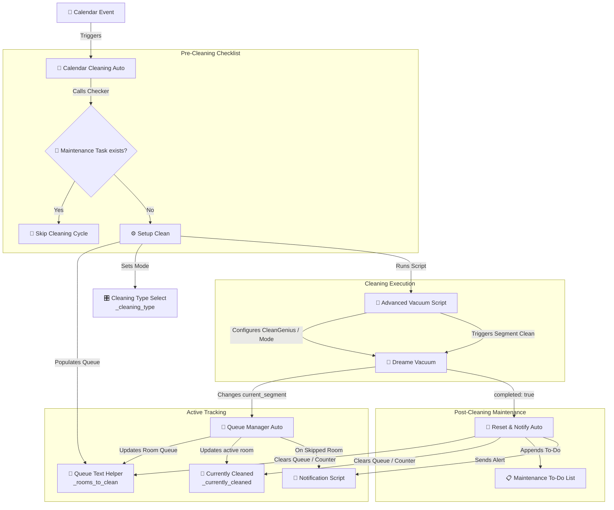

# 🧹 Dreame Vacuum Suite for Home Assistant

[](https://opensource.org/licenses/MIT)
[](https://www.home-assistant.io/)
[](https://github.com/Tasshack/dreame-vacuum)

An advanced, cohesive suite of **Home Assistant Blueprints** designed to automate and manage **Dreame Robot Vacuums** with dynamic room queueing, calendar-based scheduling, automated pre-clean checklist verification, and post-clean maintenance tasks.

---

## 🏗️ Architecture & Cleaning Workflow

The suite comprises four interconnected parts that communicate dynamically through helper entities. These entities are discovered automatically if they are assigned to the same **Device** as the vacuum robot (or share the same label).



---

## 📦 Included Blueprints

### 1. 🤖 Advanced Vacuum Script
* **Path:** `script/homeassistant/robot_vacuum.yaml`
* **Purpose:** The execution engine. Finds all necessary helper entities dynamically using the vacuum's Device ID or labels and regex matching. It sets the proper vacuum state (CleanGenius or manual sweep/mop modes) based on your target cleaning type, then initiates segment cleaning for the exact queue.
* **Dynamic Discovery Regexes:**
  * **Rooms Queue:** `^input_text\..*_rooms_to_clean$`
  * **Cleaning Type Selector:** `^input_select\..*_cleaning_type$`
  * **CleanGenius Selector:** `^select\..*_cleangenius$`
  * **Cleaning Mode Selector:** `^select\..*_cleaning_mode$`

### 2. 📅 Calendar-Based Vacuum with Task Check
* **Path:** `automation/homeassistant/vacuum_calendar_cleaning.yaml`
* **Purpose:** Triggers on a calendar event. Before scheduling, it checks if a specific maintenance task (e.g., "Clean Robot") is active on your Home Assistant To-Do list. If the task is absent:
  * It retrieves the vacuum's default cleaning sequence.
  * Filters out any ignored room IDs.
  * Automatically sets the cleaning type helper.
  * Populates the room queue helper and fires the cleaning script.

### 3. 🔄 Updating the to clean list (Queue Manager)
* **Path:** `automation/homeassistant/vacuum_queue_manager.yaml`
* **Purpose:** Monitors the vacuum during its run. When the vacuum transitions between segments (rooms), this automation:
  * Updates the `currently_cleaned` helper.
  * Shifts the queue text helper (removes the current room).
  * Automatically detects skipped rooms (notifying you if configured).
  * Ignores transit/corridor segments so they don't corrupt the queue.
  * Gracefully handles premature cancellation (e.g. if the vacuum is manually docked/paused, it clears remaining rooms and alerts you of skipped rooms).

### 4. 🧹 Reset and Notify
* **Path:** `automation/homeassistant/vacuum_reset.yaml`
* **Purpose:** Handles the completion of the cleaning cycle.
  * Resets the room queue and currently cleaned helpers back to `[]` and `0`.
  * Creates a To-Do list maintenance item (e.g., "Replace water and clean the robot").
  * Fires a custom notification script reminding you to service the dock.

---

## 🛠️ Setup & Prerequisites

For dynamic entity discovery to work, you **must** configure your helper entities and associate them properly in Home Assistant.

### 1. Create Helper Entities
Create the following helpers via **Settings > Devices & Services > Helpers**:

| Helper Type | Naming Pattern (Regex Suffix) | Purpose | Example |
| :--- | :--- | :--- | :--- |
| **Input Text** | `*_rooms_to_clean` | Holds the comma-separated queue of room IDs | `input_text.dreame_l20_rooms_to_clean` |
| **Input Number** | `*_currently_cleaned` | Stores the segment ID currently being cleaned | `input_number.dreame_l20_currently_cleaned` |
| **Input Select** | `*_cleaning_type` | Options: `vacuum`, `vacuum and mop`, `deep clean` | `input_select.dreame_l20_cleaning_type` |

### 2. Associate Helpers to the Vacuum Device
To allow the blueprints to locate these helpers dynamically:
1. Go to **Settings > Devices & Services > Devices**.
2. Find your **Dreame Vacuum** device.
3. Click **Add to** or edit the helpers you created above, and assign them to the **same Device** as your vacuum robot. 
   *(Alternatively, assign the exact same **Label** to both the vacuum entity and your helpers).*

---

## 🚀 Installation & Import

Add these blueprints to your Home Assistant instance by copying the raw file URLs from your repository:

### Blueprints URLs for Import:

1. **Advanced Vacuum Script:**
   ```
   https://github.com/<your-username>/ha-blueprints/blob/main/script/homeassistant/robot_vacuum.yaml
   ```
2. **Calendar-Based Vacuum:**
   ```
   https://github.com/<your-username>/ha-blueprints/blob/main/automation/homeassistant/vacuum_calendar_cleaning.yaml
   ```
3. **Queue Manager:**
   ```
   https://github.com/<your-username>/ha-blueprints/blob/main/automation/homeassistant/vacuum_queue_manager.yaml
   ```
4. **Reset & Notify:**
   ```
   https://github.com/<your-username>/ha-blueprints/blob/main/automation/homeassistant/vacuum_reset.yaml
   ```

---

## 📄 License
This repository is licensed under the MIT License - see the LICENSE file for details.
